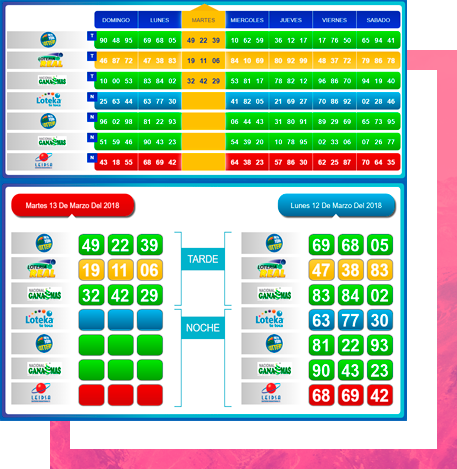
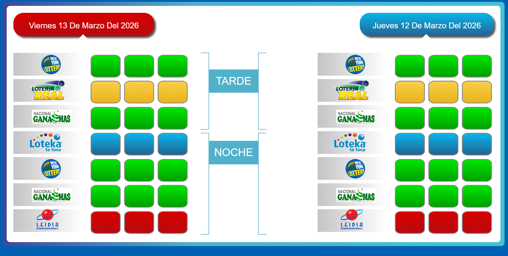
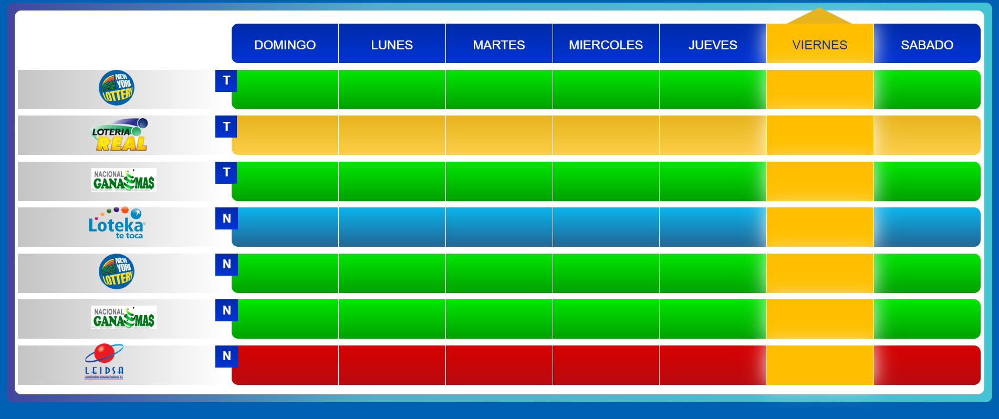

# 🎰 Números de Lotería



\[\]
\[\]
\[\]
\[\]

Aplicación web desarrollada en **PHP, JavaScript y Firebase** que
muestra los **resultados de diferentes loterías** en una interfaz visual
optimizada para ser mostrada en **pantallas de consorcios de lotería**.

El sistema obtiene los resultados desde **Firebase**, permitiendo que
los números se actualicen automáticamente en todas las pantallas
conectadas.

------------------------------------------------------------------------

# 📸 Vista previa

## Pantalla principal



## Visualización de resultados



------------------------------------------------------------------------

# ✨ Características

-   🎰 Visualización clara de **números de lotería**
-   🔄 **Actualización en tiempo real** utilizando Firebase
-   🖥 Diseñado para **pantallas grandes en consorcios**
-   ⚡ Interfaz ligera optimizada para visualización continua
-   📊 Organización de resultados por **día y horario (Tarde / Noche)**
-   🌐 Aplicación web accesible desde navegador

------------------------------------------------------------------------

# 🛠 Tecnologías utilizadas

Este proyecto fue desarrollado utilizando:

-   **PHP**
-   **JavaScript**
-   **Firebase Realtime Database**
-   **HTML5**
-   **CSS3**

Firebase permite sincronizar los resultados en tiempo real entre
múltiples dispositivos, lo que resulta ideal para sistemas de
visualización en pantallas públicas.

------------------------------------------------------------------------

# ⚙️ Cómo funciona

1.  Los números de lotería se almacenan en **Firebase Realtime
    Database**.
2.  La aplicación web se conecta a Firebase mediante JavaScript.
3.  Cuando los datos cambian:
    -   Firebase envía la actualización a todos los clientes conectados.
4.  Las pantallas muestran automáticamente los nuevos resultados.

Este sistema evita la necesidad de recargar la página manualmente.

------------------------------------------------------------------------

# 🚀 Instalación

Clonar el repositorio:

``` bash
git clone https://github.com/nvidiati/numeros.git
```

Mover el proyecto a un servidor web:

    /var/www/html/numeros

Abrir en el navegador:

    http://localhost/numeros

Configurar las credenciales de **Firebase** en el archivo
correspondiente.

------------------------------------------------------------------------

# 📁 Estructura del proyecto

    numeros
    │
    ├── index.php
    ├── js/
    ├── css/
    ├── firebase/
    ├── docs/
    │   ├── banner.png
    │   ├── capt1.png
    │   └── capt2.png
    └── README.md

------------------------------------------------------------------------

# 💡 Posibles mejoras

Algunas mejoras que podrían implementarse:

-   Panel de administración para actualizar resultados
-   Historial de sorteos
-   Soporte para más loterías
-   Animaciones para resaltar números ganadores
-   Diseño responsive para móviles
-   Exportación de resultados

------------------------------------------------------------------------

# 📚 Casos de uso

Este sistema puede utilizarse en:

-   Consorcios de **lotería**
-   Pantallas informativas en **puntos de venta**
-   Sistemas de visualización de **resultados en tiempo real**
-   Pantallas públicas de sorteos

------------------------------------------------------------------------

# 👨‍💻 Autor

**Kris Bell**

GitHub\
https://github.com/nvidiati

------------------------------------------------------------------------

# 📄 Licencia

Este proyecto se distribuye bajo la licencia **MIT**.
